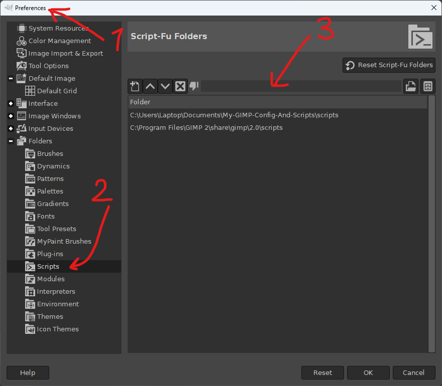

# Description
This repository contains my opinionated setup for GIMP, and my personal scripts for it.

## Who is this for?
This is for people who use GIMP in a similar way to me. Most of my work in GIMP is simple editing of pixel art, created by other, more talented people. This setup hides some of the features, that I don't consider useful for pixel art. It also removes some of the default keybindings and adds some of my own.

My scripts can be useful for anyone, depending on the script. You have to check the scripts' descriptions to see if you like them.

# User Configuration
You can find the list of the changes from the default configuration in a separate file: [user_config_changes.md](user_config_changes.md).

## Applying the configuration to your GIMP
I wrote a Python script (`config_loader.py`) that copies the configuration files from this repository to the GIMP's configuration directory (overwriting the existing files). If you have Python installed, and you know how to use it, you can run the script. It's an interactive command-line tool. WARNING: It will overwrite the files without making a backup. Use it at your own risk.

If you want to apply the changes manually, you can copy the files from the `user_config` directory to the GIMP's configuration directory. You can find the configuration directory path in GIMP's documentation: https://www.gimp.org/tutorials/GIMPProfile/

# Scripts
## List of the scripts
All scripts have their own description file. You can find them in the links below:

- [layers-sprite](layers-sprite.md) - A script for creating a sprite sheet from layers.
- [palette-swap](palette-swap.md) - A script for swapping colors in an image using pairs of color palettes.

## Installation
You can find the Script-Fu script installation instructions in the [GIMP documentation](https://docs.gimp.org/en/install-script-fu.html).

TL;DR: You can put the script files anywhere in your file system, and set the GIMP's script directory to that location:

I keep on my disk in this repository.
