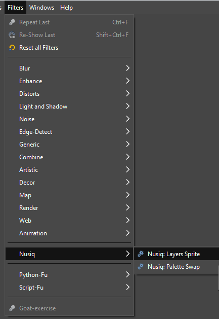

The `layers-sprite.scm` script fcreates a new image based on the layers of the active image. The images are stacked on Y axis. The script doesn't have any options. To use it, simply select it from the `Filters -> Nusiq -> Nusiq: Layers Sprite` menu.

