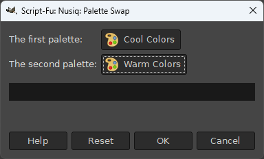

The `palette-swap.scm` script swaps colors in an image using pairs of color palettes. To use it, simply select it from the `Filters -> Nusiq -> Nusiq: Layers Sprite` menu.

This will open a dialog where you can select the source and target palettes. Both palettes should have the same number of colors.

Running the script will create a new layer on top of the active layer of the image, with the colors from the source palette replaced by the colors from the target palette element-wise. The pixels that use the colors not present in the source palette will be transparent on the new layer.
